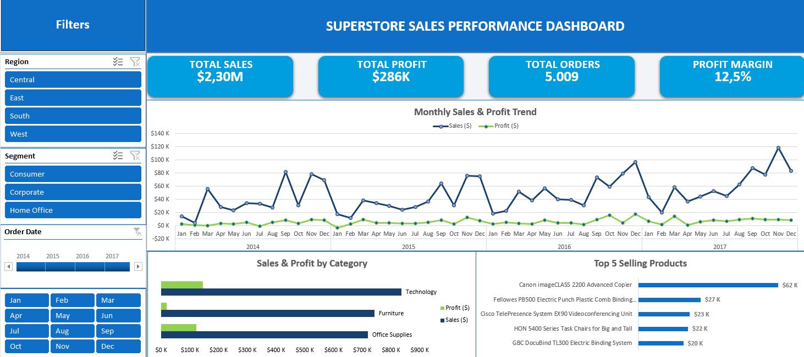

**Language:** English | [Bahasa Indonesia](README.id.md)

# Superstore Sales & Performance Dashboard (Excel)

An interactive Excel dashboard that analyzes sales, profitability, and order trends for a retail company (Superstore, 2014-2017). It uses Power Query for data import, PivotTables and PivotCharts for analysis, and slicers plus a timeline for interactive filtering.

## Dashboard Preview

## Business Questions
1. How much does the business sell and earn, and what is the overall profit margin?
2. How do sales and profit change over time, and when are the peak seasons?
3. Which product categories and products drive sales and profit?
4. How do results differ by region and customer segment?

## Dataset
- **Source:** Sample - Superstore dataset
- **Size:** 9,994 rows, 21 columns, order dates from January 2014 to December 2017
- **Orders:** 5,009 unique orders (the dataset has one row per order line item)
- The raw CSV is not included in this repository.

## Key Metrics
| Metric | Value |
|---|---|
| Total Sales | $2.30M |
| Total Profit | $286K |
| Profit Margin | 12.5% |
| Total Orders (unique) | 5,009 |

## Workflow
1. **Import (Power Query):** loaded the CSV into an Excel table named `Dataset`.
2. **Data validation:** checked row count, duplicate rows, missing values, date range, and totals (see the data quality note below).
3. **Analysis:** built five PivotTables (KPIs, monthly trend, category, top products, region) in a `Pivot` sheet.
4. **Dashboard:** three PivotCharts, KPI cards linked to PivotTable cells, slicers (Region, Segment, Month), and a timeline for Order Date, all connected to every PivotTable.
5. **Presentation:** consistent colour scheme, aligned layout, and clear chart legends.

## Data Quality Note
In an early version, the KPI cards showed a profit larger than sales (a 159% margin). The cause was the data import: because of Indonesian regional settings, the decimal point was read as a thousands separator, and columns such as `Sales`, `Discount`, and `Profit` were stored as whole numbers (for example, `261.96` became `26196`).

**Fix:** reloaded the data in Power Query and changed the data types using the English (United States) locale. After that, I validated the totals (sales, profit, margin, and unique orders) and checked that the first rows matched the source file.

## Key Findings
- Sales rise every September and again in November-December; the highest month is November 2017 (about $118K).
- Technology is the strongest category in both sales and profit.
- Furniture has high sales but the lowest profit, so high sales do not guarantee high profitability.
- The top-selling product is the Canon imageCLASS 2200 Advanced Copier (about $62K).

## Suggested Next Steps
- Investigate why Furniture profit is low (for example, discounts or product costs).
- Prepare stock and promotions ahead of the September and November-December peaks.
- Compare margins by region and segment using the slicers.

## Limitations
- Sample dataset, so findings illustrate the analysis approach and do not describe a real company.
- The Power Query source points to a local file path; refreshing on another computer requires changing the data source.
- Slicers and timelines work best in desktop Excel (2013 or newer).

## How to Use
1. Download `Superstore_Sales_Dashboard.xlsx` and open it in Excel.
2. Open the `Dashboard` sheet and use the slicers (Region, Segment, Month) and the Order Date timeline.
3. Click the funnel icon with a cross on a slicer to clear its filter.

## Tools
Microsoft Excel · Power Query · PivotTables and PivotCharts · Slicers and Timeline

## Author
**Alnanda**
www.linkedin.com/in/alnandakusuma · https://github.com/alnandakusuma
